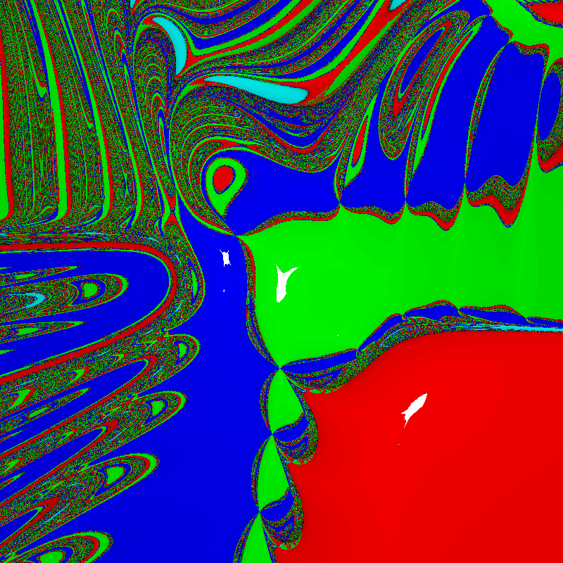

# SymbolicCalculator
Small C++ project to represent multivariable polynomials and perform computations on them.

Represent polynomials (i.e. symbolic expressions) with SymExp objects, which are a vector of Product objects. Each Product object contains ids and powers to efficiently represent factors of the product. 

## Current Features:
- multiplying, adding, and subtraction expressions with each other. 

- Substituting variables with other SymExps using the SymExpTable class, which can be used to evaluate the symbolic expressions like a function. Also supports printing out expressions by converting symbol ids to text, converting back into SymExp is planned, but low priority.

- Calculating the derivative or gradient of expressions

- Using generalized Newton's method to find zeros of a expression or vector of expressions (to represent a system of polynomials) with quadratic convergence near roots

- Flattened SymExp structure to more efficiently evaluate, calculate gradient, and use Newton's Method on (currently only supports converting from unflattened to flattened)

- Displaying the fractals that result from Newton's method using SFML and textures

## Future Features

- Porting over FlatSymExp to OpenCL to allow for parallel computation of Newton's Method for pixels.

- Moving and zooming in on fractal.

- Basic API headers and documentation to facilitate inclusion in other projects

Example of a fractal resulting from the convergence of generalized Newton's Method applied to a system of two random two variable, 4th order polynomials.